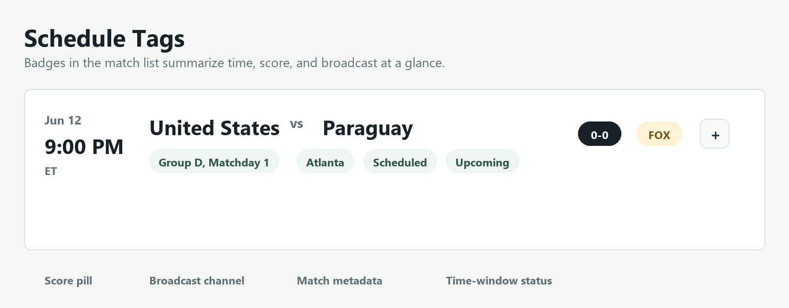
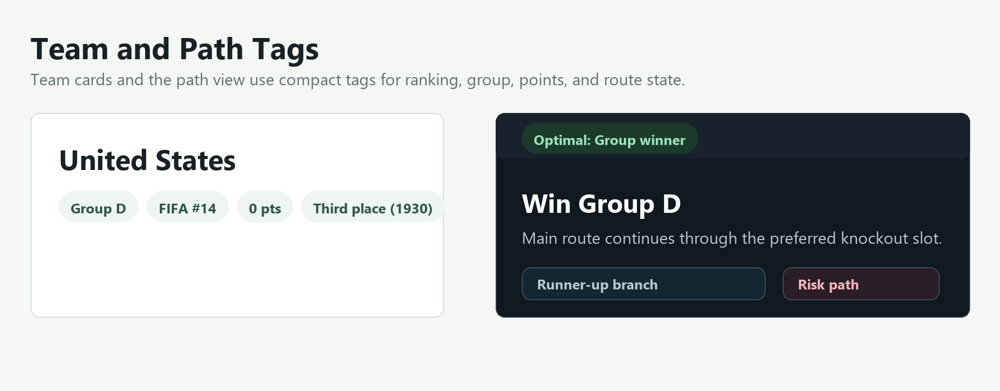
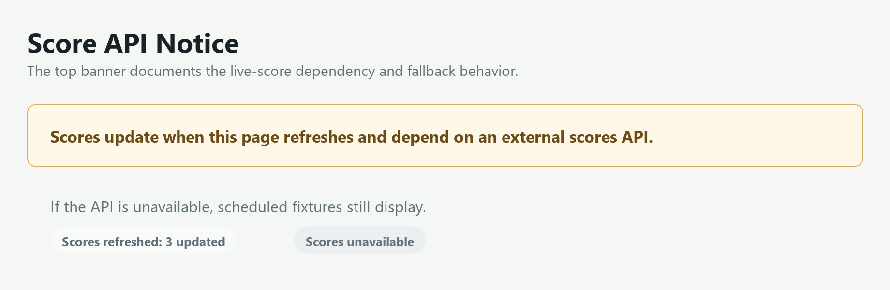

# Path To The Cup 2026

A local/static web app for tracking the 2026 FIFA World Cup.

## Features

- Schedule view with local/UTC kickoff times and English broadcast badges
- Group standings with points and FIFA ranking
- Team cards with FIFA-style country codes and best-ever World Cup result
- Historical rivalry and matchup context in expandable game details
- Path-to-the-cup visualization with an optimal route and diverging branches
- Search, filters, and sorting by date, A-Z, Z-A, and FIFA rank
- Browser translation hints and a timezone selector for local browser time or UTC

## Tag Guide

The app uses compact tags to keep dense tournament information readable.

### Schedule Tags



- `Score pill`: current score returned by the external scores API.
- `FOX` / `FS1`: expected English broadcast channel.
- `Group D, Matchday 1`, venue, and status tags: match metadata.
- `Upcoming`, `Started within 4h`, `Live 42'`, or `Previous`: time-window and live-clock status used by the schedule filter.
- `+`: expands match details, including broadcast, score source, stage impact, and matchup context.

### Team and Path Tags



- `Group`: the team's group assignment.
- `Country code`: three-letter team code used in cards, standings, and match rows.
- `FIFA #`: current FIFA world ranking used for sort and context.
- `pts`: current group-stage points.
- `Best result`: the team's best historical World Cup finish.
- `Optimal: Group winner`: the highlighted path assumption in the route view.
- `Runner-up branch` and `Risk path`: diverging knockout routes if the team does not win the group.

### Score API Tags



- The top notice explains that scores update on page refresh and depend on an external API.
- `Scores refreshed: n updated`: score data was fetched and matched to local fixtures.
- `Scores unavailable`: the app could not reach the API, so scheduled fixtures remain visible.

## Run Locally

Open `index.html` in a browser, or serve the folder with any static file server.

## Language and Timezone

The app sets browser language hints from `navigator.language` so built-in browser translation tools can detect and translate page text, including dynamically rendered match details.

Schedule times default to your browser's local timezone. Use the `Time` selector in the Schedule toolbar to switch between local time and UTC. The selection is saved in `localStorage`.

Kickoff times are stored in `app.js` as UTC ISO timestamps ending in `Z`. Local display is derived from the user's system/browser timezone with `Intl.DateTimeFormat`, so the same fixture will automatically render differently for viewers in different regions. Fixtures, kickoff times, stadiums, and listed broadcast channels are validated against ESPN's FIFA World Cup schedule data.

## Live Scores

Scores are checked on page refresh.

By default, the app calls `api/scores`, which is intended to be a small serverless proxy that returns JSON shaped like `scores.sample.json`. If that proxy is unavailable, the app falls back to ESPN's public FIFA World Cup scoreboard feed. Do not commit paid/private API keys into `app.js`.

The same refresh can also update fixtures as the tournament progresses. If the API returns known `homeTeam` / `awayTeam` names for a knockout match that still has placeholder entrants, the app replaces the placeholders with those teams. Include an app fixture `id` when possible; otherwise include the UTC `date` so the app can match a resolved knockout fixture by kickoff time. The proxy can also send `venue`, `channel`, or `channels` to update stadium and broadcast data.

## Standings and Elimination

When score data is returned, the app recalculates group tables from the match results:

- Live and final group scores update played, wins, draws, losses, goals, goal difference, and points.
- Final group results determine `Qualified`, `Third-place bubble`, `At risk`, and `Eliminated` tags.
- Top two teams in a completed group are marked qualified.
- Third-place teams remain in the bubble until all groups are complete; then the best eight third-place teams are marked qualified and the rest are eliminated.
- Final knockout results mark the losing team eliminated and the winning team advanced.
- The final winner is marked `Champion`.

Tile colors:

- Green: qualified, advanced, or champion.
- Amber: third-place bubble or at risk.
- Gray: eliminated.

For football-data.org testing, set your token in the browser console:

```js
localStorage.setItem("footballDataToken", "YOUR_TOKEN")
```

Then refresh the page. Clear it with:

```js
localStorage.removeItem("footballDataToken")
```

## Regenerate README Screenshots

The README screenshots are generated locally with Pillow:

```powershell
& 'C:\Users\cjsco\.cache\codex-runtimes\codex-primary-runtime\dependencies\python\python.exe' work\generate_readme_screenshots.py
```
